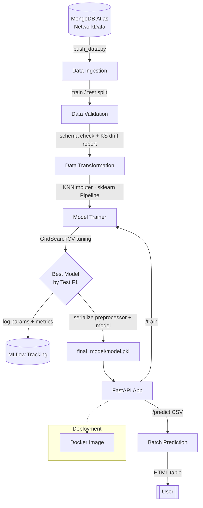

# 🛡️ Network Security — Phishing Detection (End-to-End ML Pipeline)

An end-to-end, production-style Machine Learning pipeline that detects **phishing websites** from network/URL features. The project covers the full ML lifecycle — data ingestion from MongoDB, schema validation and drift detection, transformation, multi-model training with hyperparameter tuning and MLflow tracking, and serving through a FastAPI REST API, containerized with Docker.

<p align="center">
  
  
  
  
  
  
</p>

---

## 📌 Table of Contents

- [Overview](#-overview)
- [Architecture](#-architecture)
- [Tech Stack](#-tech-stack)
- [Project Structure](#-project-structure)
- [Pipeline Stages](#-pipeline-stages)
- [Getting Started](#-getting-started)
- [Usage](#-usage)
- [API Endpoints](#-api-endpoints)
- [Experiment Tracking (MLflow)](#-experiment-tracking-mlflow)
- [Docker](#-docker)
- [Author](#-author)

---

## 🔍 Overview

Phishing attacks remain one of the most common network-security threats. This project frames phishing detection as a **binary classification** problem and wraps the solution in a **modular, config-driven ML pipeline** with custom exception handling, structured logging, and a clean separation between configuration, components, and artifacts.

**Key highlights**

- Modular package architecture installable via `pip install -e .`
- Data ingestion directly from **MongoDB Atlas**
- Automated **schema validation** and **data-drift detection** (Kolmogorov–Smirnov test)
- **5 classifiers** trained and tuned with `GridSearchCV`, best model auto-selected
- Full experiment tracking with **MLflow** (params + F1 / precision / recall)
- **FastAPI** service for training and batch CSV prediction
- **Docker**-ready for deployment

---

## 🏗 Architecture



> The pipeline runs as a strict sequence — **Ingestion → Validation → Transformation → Training** — where each stage emits a typed *artifact* consumed by the next stage.

---

## 🧰 Tech Stack

| Layer | Technologies |
|-------|--------------|
| **Language** | Python |
| **Data Handling** | Pandas, NumPy |
| **Storage / Ingestion** | MongoDB Atlas, PyMongo, python-dotenv |
| **Validation** | YAML schema, SciPy (`ks_2samp` drift test) |
| **Transformation** | Scikit-Learn `Pipeline`, `KNNImputer` |
| **Modeling** | Scikit-Learn (RandomForest, GradientBoosting, AdaBoost, DecisionTree, LogisticRegression), GridSearchCV |
| **Experiment Tracking** | MLflow |
| **Serving / API** | FastAPI, Uvicorn, Jinja2, python-multipart |
| **Visualization** | Matplotlib, Seaborn |
| **Deployment** | Docker, GitHub Actions (CI/CD) |

---

## 📂 Project Structure

```
networksecurity/
├── networksecurity/                  # Core installable package
│   ├── components/
│   │   ├── data_ingestion.py         # Pull data from MongoDB → feature store / train-test split
│   │   ├── data_validation.py        # Schema check + KS drift detection
│   │   ├── data_transformation.py    # KNNImputer pipeline → NumPy arrays
│   │   └── model_trainer.py          # Multi-model GridSearch + MLflow logging
│   ├── constants/
│   │   └── training_pipeline/        # Paths, thresholds, schema & file names
│   ├── entity/
│   │   ├── config_entity.py          # Config dataclasses for each stage
│   │   └── artifact_entity.py        # Output artifact dataclasses
│   ├── pipeline/
│   │   ├── training_pipeline.py      # Orchestrates the full training flow
│   │   └── batch_prediction.py       # Runs inference on uploaded CSVs
│   ├── utils/
│   │   ├── mains_utils/utils.py      # save/load objects, arrays, model evaluation
│   │   └── ml_utils/
│   │       ├── matrics/classification_metric.py  # F1 / precision / recall
│   │       └── models/estimater.py   # NetworkModel (preprocessor + model wrapper)
│   ├── exception/exception.py        # NetworkSecurityException
│   └── logging/logger.py             # Structured logging
│
├── Network_Data/                     # Raw phishing dataset (phisingData.csv)
├── data_schema/                      # schema.yaml (expected columns)
├── final_model/                      # Serialized preprocessor + best model
├── templetes/                        # Jinja2 HTML templates (table.html)
├── valid_data / prediction_output/   # Validated inputs & prediction artifacts
│
├── app.py                            # FastAPI application (train / predict / health)
├── main.py                           # Run the training pipeline from CLI
├── push_data.py                      # Load CSV → MongoDB
├── Dockerfile                        # Container build
├── requirements.txt                  # Dependencies
├── setup.py                          # Makes the project pip-installable
└── README.md
```

---

## ⚙️ Pipeline Stages

1. **Data Ingestion** — Connects to MongoDB Atlas, reads the `NetworkData` collection into a DataFrame, and produces a train/test split as artifacts.
2. **Data Validation** — Validates the incoming data against `schema.yaml` (column count and names) and runs a **Kolmogorov–Smirnov two-sample test** (`scipy.stats.ks_2samp`) to flag dataset drift against a configurable threshold; outputs a drift report.
3. **Data Transformation** — Builds a Scikit-Learn `Pipeline` with `KNNImputer` to handle missing values, normalizes labels (`-1 → 0`), and serializes the transformed arrays + the fitted preprocessor object.
4. **Model Training** — Trains and tunes 5 classifiers via `GridSearchCV`, evaluates them on **F1 / precision / recall**, auto-selects the best model by test F1, applies **overfitting/underfitting guardrails**, logs everything to **MLflow**, and saves the final `preprocessor + model` bundle.

---

## 🚀 Getting Started

### Prerequisites

- Python 3.10+
- A MongoDB Atlas connection string
- (Optional) Docker

### Installation

```bash
# 1. Clone the repository
git clone https://github.com/deva3004/networksecurity.git
cd networksecurity

# 2. Create and activate a virtual environment
python -m venv venv
source venv/bin/activate        # Windows: venv\Scripts\activate

# 3. Install dependencies (editable install)
pip install -r requirements.txt
pip install -e .
```

### Environment Variables

Create a `.env` file in the project root:

```env
MONGO_USERNAME=your_username
MONGO_PASSWORD=your_password
MONGO_CLUSTER=your-cluster.xxxxx.mongodb.net
```

---

## 💻 Usage

**1. Push the dataset to MongoDB**

```bash
python push_data.py
```

**2. Run the training pipeline (CLI)**

```bash
python main.py
```

**3. Launch the API**

```bash
python app.py
# or
uvicorn app:app --host 0.0.0.0 --port 8080 --reload
```

Then open **http://localhost:8080** for the UI, or **http://localhost:8080/docs** for the interactive Swagger documentation.

**4. Batch prediction** — Upload a CSV of network features to `/predict` and the API returns predictions rendered as an HTML table.

---

## 🌐 API Endpoints

| Method | Endpoint | Description |
|--------|----------|-------------|
| `GET`  | `/` | Home page (HTML UI) |
| `GET`  | `/health` | Health check |
| `POST` | `/train` | Trigger the full training pipeline; returns train/test metrics |
| `POST` | `/predict` | Upload a CSV → returns predictions as an HTML table |

---

## 📊 Experiment Tracking (MLflow)

Every training run logs the chosen hyperparameters and train/test metrics to MLflow.

```bash
mlflow ui
# Visit http://localhost:5000
```

Tracked per run: model name, best `GridSearchCV` params, and **F1 / precision / recall** for both train and test sets, along with the serialized scikit-learn estimator.

---

## 🐳 Docker

```bash
# Build the image
docker build -t networksecurity .

# Run the container
docker run -p 8080:8080 --env-file .env networksecurity
```

---

## 👤 Author

**Devashish Tripathi**
📧 tripathidevashish@gmail.com
🔗 [GitHub](https://github.com/deva3004)

---

⭐ If you find this project useful, consider giving it a star!
